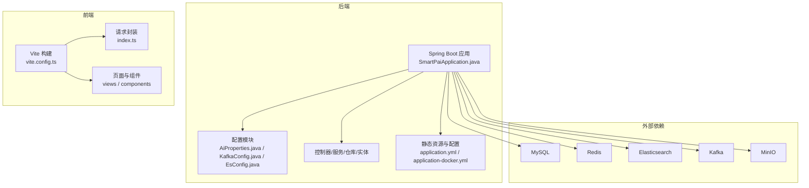
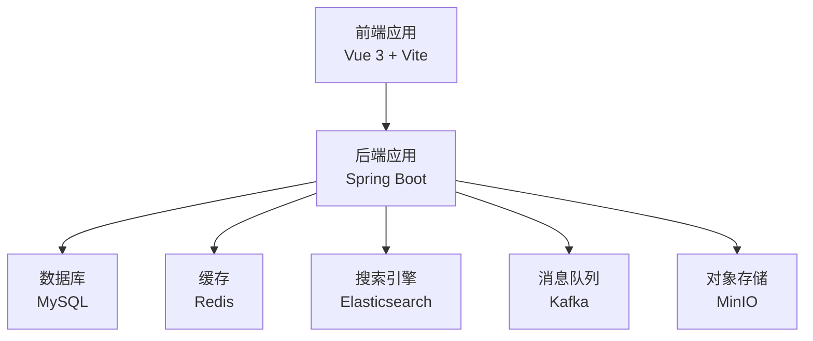
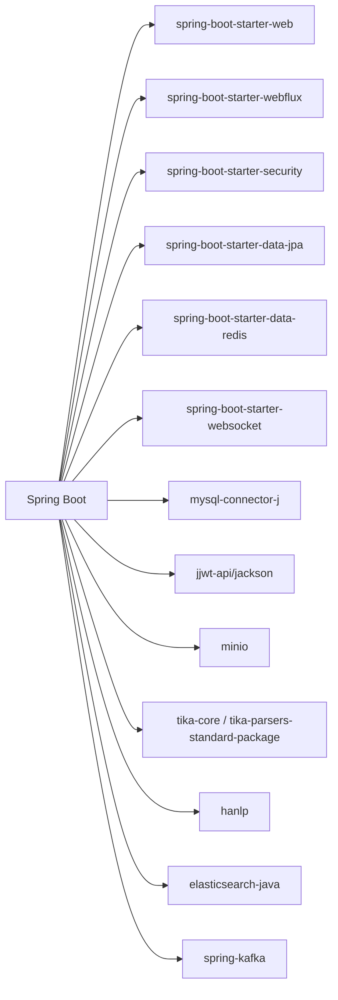

# 快速开始

## 目录
1. [简介](#简介)
2. [项目结构](#项目结构)
3. [核心组件](#核心组件)
4. [架构总览](#架构总览)
5. [详细组件分析](#详细组件分析)
6. [依赖关系分析](#依赖关系分析)
7. [性能注意事项](#性能注意事项)
8. [故障排查指南](#故障排查指南)
9. [结论](#结论)
10. [附录](#附录)

## 简介
KnowFlow 知识库管理系统是一个企业级的RAG（检索增强生成）知识库平台，支持多租户、文档上传与解析、向量化检索、实时对话与AI生成。系统采用现代化的云原生架构，后端基于Spring Boot 3.4.2（Java 17），前端基于Vue 3 + TypeScript，后端核心依赖包括MySQL、Redis、Elasticsearch、Kafka、MinIO、JWT安全认证、WebSocket实时通信等。

本快速开始指南将帮助你完成环境准备、项目克隆、依赖安装、数据库初始化、配置文件设置、启动与验证，以及Docker部署方案，覆盖从零基础到有经验开发者的不同需求。

## 项目结构
项目采用前后端分离的多模块结构：
- 后端：Spring Boot应用，位于 src/main/java/com/yizhaoqi/smartpai，包含配置、控制器、服务、仓库、实体、工具等。
- 前端：Vue 3 + TypeScript 应用，位于 frontend，包含路由、状态管理、API封装、UI组件等。
- 文档与部署：docs 目录包含数据库DDL、Docker Compose编排、Nginx示例等。

## 核心组件
- 后端核心依赖与版本
  - Java 17、Spring Boot 3.4.2、MySQL 8.0、Redis 7.0、Elasticsearch 8.10.0、Kafka 3.2.1、MinIO 8.5.12、JWT、WebSocket、WebFlux、Tika、HanLP等。
- 前端核心依赖与版本
  - Vue 3、TypeScript、Vite、Naive UI、Pinia、Vue Router、UnoCSS、SCSS、pnpm 8.7.0+、Node.js 18.20.0+。
- 关键配置
  - application.yml 中包含数据库、Redis、Kafka、MinIO、Elasticsearch、JWT、AI提示词与生成参数等配置。
  - application-docker.yml 提供Docker环境下的配置示例。
  - docker-compose.yaml 提供一键拉起MySQL、Redis、MinIO、Kafka、Elasticsearch的编排。

## 架构总览
系统采用“前端 + 后端 + 多外部中间件”的架构，后端通过REST API与前端交互，同时通过Kafka异步处理文件解析任务，Elasticsearch提供向量与关键词混合检索，MinIO负责对象存储，Redis提供缓存与会话，JWT保障安全认证，WebSocket提供实时对话。

## 详细组件分析

### 环境准备与前置条件
- 必备软件与版本
  - Java 17、Maven 3.8.6+、Node.js 18.20.0+、pnpm 8.7.0+、MySQL 8.0、Elasticsearch 8.10.0、MinIO 8.5.12、Kafka 3.2.1、Redis 7.0.11、Docker（可选）。
- 建议操作系统
  - Windows/Linux/macOS均可，推荐Linux或WSL2以获得最佳性能。

### 项目克隆与依赖安装
- 克隆仓库
  - 使用Git克隆项目到本地工作目录。
- 后端依赖安装
  - 进入项目根目录，执行Maven构建（如需离线或加速可配置镜像源）。
- 前端依赖安装
  - 进入 frontend 目录，使用 pnpm 安装依赖（建议使用 pnpm 8.7.0+）。

### 数据库初始化
- 方案一：使用Docker一键拉起MySQL
  - 使用 docs/docker-compose.yaml 启动MySQL容器，默认root密码为PaiSmart2025。
- 方案二：本地安装MySQL 8.0
  - 创建数据库PaiSmart，字符集utf8mb4，排序规则utf8mb4_unicode_ci。
- 初始化表结构
  - 使用 docs/databases/ddl.sql 在PaiSmart数据库中执行建表语句，创建users、organization_tags、file_upload、chunk_info、document_vectors等表。

### 配置文件设置
- 后端配置
  - application.yml：设置数据库连接、Redis、Kafka、MinIO、Elasticsearch、JWT、AI提示词与生成参数等。
  - application-docker.yml：提供Docker环境下的配置示例（端口、密码、连接地址等）。
- 前端配置
  - vite.config.ts：开发服务器端口、代理、别名等。
  - index.ts：统一请求封装，包含鉴权头注入、错误处理、Token刷新等逻辑。

### 启动命令与验证
- 后端启动
  - 进入项目根目录，执行Maven打包或直接运行Spring Boot主类 SmartPaiApplication。
  - 默认端口为8081，可在application.yml中修改。
- 前端启动
  - 进入 frontend 目录，执行 pnpm run dev，开发服务器默认端口为9527。
- 验证
  - 后端：访问 http://localhost:8081/swagger-ui.html 或 /actuator（如开启）。
  - 前端：访问 http://localhost:9527，登录后进入知识库管理页面。
  - 外部服务：确认MySQL、Redis、MinIO、Kafka、Elasticsearch均处于健康状态。

### Docker部署简化方案
- 使用 docker-compose.yaml
  - 一键拉起MySQL、Redis、MinIO、Kafka、Elasticsearch，自动创建所需Topic与Elasticsearch插件。
  - 注意：Elasticsearch默认密码为PaiSmart2025，MinIO默认访问密钥为admin/PaiSmart2025。
- 后端切换Docker配置
  - 使用 application-docker.yml 作为运行配置，确保数据库、Redis、Elasticsearch、Kafka、MinIO的连接地址与端口与compose一致。

### 常见环境问题与调试技巧
- Java版本不匹配
  - 确保使用Java 17；若IDE提示版本不兼容，检查Maven属性与IDE JDK设置。
- Node.js/pnpm版本不匹配
  - 前端要求Node.js >= 18.20.0，pnpm >= 8.7.0；升级后重新安装依赖。
- 数据库连接失败
  - 检查application.yml中的数据库URL、用户名、密码；确认MySQL已启动且端口3306可用。
- Elasticsearch无法连接
  - 确认ES端口9200开放，用户名密码正确；如使用HTTPS请检查证书配置。
- Kafka无法连接
  - 确认Kafka端口9092开放，Topic已创建；消费组ID与配置一致。
- MinIO无法连接
  - 确认MinIO端口19000/19001开放，访问密钥与桶名配置正确。
- JWT与安全认证
  - 确认JWT密钥配置；登录后检查前端是否正确携带Authorization头。
- WebSocket与实时通信
  - 检查后端WebSocket配置与前端连接逻辑；确认Nginx或反向代理未拦截WebSocket升级。

## 依赖关系分析
后端依赖关系（部分）：
- Spring Boot Starter：Web、WebFlux、Security、Data JPA、Data Redis、WebSocket。
- 中间件SDK：MinIO、Elasticsearch Java Client、Apache Kafka。
- 工具库：JWT、Tika、HanLP、Jackson/Gson、HTTP Client等。

## 性能注意事项
- Elasticsearch
  - 合理设置IK分词插件与索引映射；根据数据规模调整副本与分片数量。
- Kafka
  - 生产者幂等与事务配置；消费者批量拉取与自动提交策略；死信队列处理异常消息。
- MinIO
  - 分片上传与断点续传；合理设置桶策略与访问权限。
- Redis
  - 缓存键设计与过期策略；避免热点Key；持久化策略（AOF/RDB）。
- 数据库
  - 合理索引设计；慢查询优化；连接池配置；读写分离（可选）。
- 前端
  - 资源压缩与懒加载；图片与代码分割；WebSocket连接复用。

## 故障排查指南
- 启动失败
  - 查看后端日志，确认端口占用与依赖服务连通性。
  - 前端启动失败：检查Node.js版本与pnpm缓存，清理node_modules后重装。
- 登录与鉴权
  - 检查JWT密钥与登录接口返回；确认前端Authorization头注入逻辑。
- 文件上传与解析
  - 检查MinIO桶是否存在；Kafka消费者组是否正常；ES索引映射是否正确。
- 实时对话
  - 检查WebSocket握手与心跳；Nginx或反向代理是否支持WebSocket升级。

## 附录

### 启动顺序与验证清单
- 启动外部服务
  - docker-compose up -d（MySQL、Redis、MinIO、Kafka、Elasticsearch）
- 初始化数据库
  - 执行 ddl.sql 创建表结构
- 启动后端
  - Maven构建并运行Spring Boot主类
- 启动前端
  - pnpm run dev
- 验证
  - Swagger/Actuator、前端登录、文件上传、实时对话、向量检索
